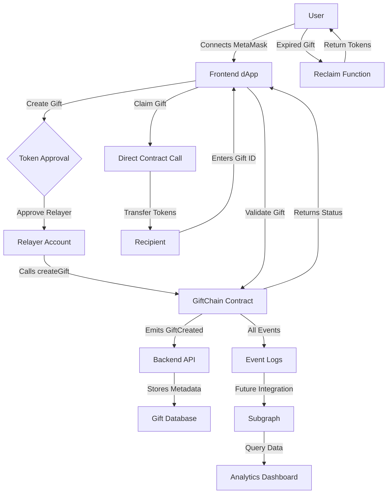

# GiftChain

GiftChain is a decentralized application (dApp) that simplifies crypto gifting. It allows users to send and receive cryptocurrency gifts securely and effortlessly, leveraging blockchain technology with complete frontend-backend integration.

---

## Table of Contents
- [GiftChain](#giftchain)
  - [Table of Contents](#table-of-contents)
  - [Overview](#overview)
  - [Features](#features)
  - [Tech Stack](#tech-stack)
    - [Frontend](#frontend)
    - [Backend](#backend)
    - [Smart Contracts](#smart-contracts)
    - [Web3 Integration](#web3-integration)
  - [Project Structure](#project-structure)
  - [Quick Start](#quick-start)
    - [Prerequisites](#prerequisites)
    - [Installation & Setup](#installation--setup)
  - [Smart Contracts](#smart-contracts-1)
    - [Overview](#overview-1)
    - [Key Features](#key-features)
    - [Testing](#testing)
  - [Integration Features](#integration-features)
  - [Contributing](#contributing)
- [GiftChain Workflow](#giftchain-workflow)

---

## Overview

GiftChain is designed to make crypto gifting as simple as sending a message. It provides a user-friendly interface for creating, claiming, and managing crypto gifts, with features like expiration dates, secure transfers, and blockchain transparency. At its core, GiftChain prioritizes user privacy by concealing the sender's address through a relayer pattern.

---

## Features

- **🎁 Create Gifts**: Create crypto gifts with customizable amounts and expiration dates
- **🔗 MetaMask Integration**: Seamless wallet connection and transaction signing
- **💰 ERC20 Support**: Support for any ERC20 token transfers
- **⏰ Expiration Management**: Automatic gift expiration and reclaim functionality
- **🔒 Privacy Protection**: Sender anonymity through relayer architecture
- **📱 Responsive UI**: Modern, mobile-friendly interface with Tailwind CSS
- **🔍 Gift Validation**: Real-time gift status checking and validation
- **📊 Transaction Tracking**: Complete gift lifecycle management

---

## Tech Stack

### Frontend
- **React 18**: Modern UI library with hooks
- **TypeScript**: Type-safe development
- **Tailwind CSS**: Utility-first CSS framework
- **Ethers.js**: Ethereum blockchain interaction
- **Vite**: Fast build tool and dev server

### Backend
- **Node.js**: JavaScript runtime
- **Express**: Web application framework
- **CORS**: Cross-origin resource sharing
- **RESTful API**: Gift metadata management

### Smart Contracts
- **Solidity ^0.8.28**: Smart contract language
- **Hardhat**: Development environment
- **OpenZeppelin**: Security-audited contract libraries
- **Comprehensive Testing**: 6 test cases with 100% pass rate

### Web3 Integration
- **MetaMask**: Wallet connection and transaction signing
- **Local Hardhat Network**: Development blockchain
- **Contract ABIs**: Type-safe contract interactions

---

## Project Structure

```
GiftChain/
├── Frontend/                    # React TypeScript frontend
│   ├── src/
│   │   ├── components/          # UI components (CreateGift, ClaimGift, WalletConnect)
│   │   ├── hooks/              # Custom React hooks (useWeb3)
│   │   ├── services/           # API and blockchain services
│   │   ├── config/             # Contract addresses and ABIs
│   │   ├── types/              # TypeScript declarations
│   │   └── pages/              # Application pages
│   ├── package.json            # Frontend dependencies
│   └── vite.config.ts          # Vite configuration
├── backend/                     # Express.js API server
│   ├── src/
│   │   └── server.js           # Main server file with gift endpoints
│   └── package.json            # Backend dependencies
├── SmartContracts/             # Ethereum smart contracts
│   ├── contracts/              # Solidity contracts
│   │   ├── GiftChain.sol       # Main gift contract
│   │   ├── MockERC20.sol       # Test token contract
│   │   └── Library/            # Custom error library
│   ├── test/                   # Comprehensive test suite
│   ├── scripts/                # Deployment scripts
│   └── hardhat.config.js       # Hardhat configuration
├── Subgraph/                   # The Graph integration (future)
│   ├── schema.graphql          # Subgraph schema
│   └── mappings/               # Event mapping functions
├── INTEGRATION_SETUP.md        # Complete setup guide
└── README.md                   # Project documentation
```

## Quick Start

### Prerequisites

- **Node.js** (v16 or higher)
- **npm** or **yarn**
- **MetaMask** browser extension
- **Git** for cloning the repository

### Installation & Setup

1. **Clone the repository:**
```bash
git clone https://github.com/ridamk65/GiftChain.git
cd GiftChain
```

2. **Start Hardhat Local Network:**
```bash
cd SmartContracts
npm install
npx hardhat node
```

3. **Deploy Smart Contracts** (in new terminal):
```bash
cd SmartContracts
npx hardhat run scripts/deploy.js --network localhost
```

4. **Start Backend API** (in new terminal):
```bash
cd backend
npm install
npm run dev
```

5. **Start Frontend** (in new terminal):
```bash
cd Frontend
npm install
npm run dev
```

6. **Configure MetaMask:**
   - Add Hardhat Network: RPC URL `http://127.0.0.1:8545`, Chain ID `31337`
   - Import test accounts from Hardhat node output

7. **Update Contract Addresses:**
   - Copy deployed contract addresses to `Frontend/src/config/contracts.ts`

🎉 **Your GiftChain dApp is now running at `http://localhost:5173`**

## Smart Contracts

### Overview

The GiftChain smart contract is the backbone of the application, enabling secure creation, claiming, and reclaiming of crypto gifts. Built with Solidity ^0.8.28 and using OpenZeppelin libraries for security, the contract implements a relayer pattern for enhanced privacy.

### Key Features

**🎁 Gift Creation (Relayer-Only)**
- Relayer creates gifts on behalf of users for privacy
- Supports any ERC20 token
- Customizable expiration dates
- Personalized messages (3-50 characters)
- Unique gift IDs with PENDING status

**🎯 Gift Claiming**
- Direct claiming by recipients
- Automatic validation (PENDING status, not expired, not creator)
- Secure token transfer using SafeERC20
- Status update to CLAIMED

**🔄 Gift Reclaiming**
- Creator can reclaim expired gifts
- Only allowed after expiration
- Prevents double claiming
- Returns tokens to original creator

**✅ Gift Validation**
- Real-time status checking
- Returns validity and descriptive messages
- Supports frontend validation

**🔒 Security Features**
- ReentrancyGuard protection
- Custom error handling
- Comprehensive input validation
- Access control with relayer pattern

### Testing

**Comprehensive Test Suite:**
- ✅ 6 test cases with 100% pass rate
- ✅ Gift creation and claiming functionality
- ✅ Access control and error handling
- ✅ Expiration and validation logic
- ✅ Gas usage optimization

```bash
cd SmartContracts
npx hardhat test
```

## Integration Features

**🔗 Web3 Integration**
- MetaMask wallet connection
- Automatic network switching
- Real-time account management
- Transaction signing and confirmation

**🎨 Modern UI/UX**
- Responsive design with Tailwind CSS
- Intuitive gift creation flow
- Real-time gift validation
- Transaction status feedback

**🔧 Backend API**
- RESTful endpoints for gift metadata
- CORS-enabled for frontend communication
- In-memory storage (easily replaceable with database)
- Gift lifecycle tracking

**📊 Development Tools**
- TypeScript for type safety
- Comprehensive error handling
- Hot reload development
- Automated testing suite

## Contributing

We welcome contributions! Please follow these steps:

1. Fork this repository
2. Create a new branch:
```bash
git checkout -b feature/your-feature-name
```

3. Commit your changes:
```bash
git commit -m "Add your message here"
```

4. Push to your branch:
```bash
git push origin feature/your-feature-name
```

5. Open a pull request

# GiftChain Workflow



**Key Components:**
- **Frontend**: React dApp with MetaMask integration
- **Relayer**: Privacy-preserving gift creation
- **Smart Contract**: Core gift logic and token management
- **Backend API**: Metadata storage and retrieval
- **MetaMask**: Wallet connection and transaction signing